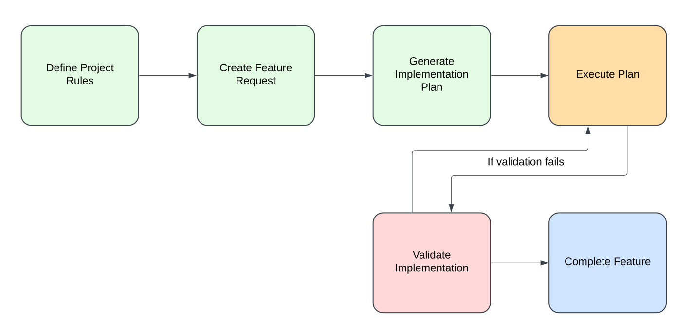

# Context Engineering: The Future of AI-Assisted Development

## Introduction

Welcome to the Context Engineering guide for students! This repository provides a comprehensive framework for leveraging AI tools effectively in your software development projects. As AI assistants become increasingly powerful, the way we interact with them needs to evolve beyond simple "vibe coding" to a more structured approach.

## What is Vibe Coding?

"Vibe coding" refers to the practice of using AI coding assistants without a clear plan or structure. It involves:

- Sending vague, incomplete prompts to AI
- Hoping the AI "gets the vibe" of what you want
- Iterating through multiple attempts when the AI misunderstands
- Relying on the AI to fill in massive gaps in your requirements

While this approach might work for simple tasks, it quickly breaks down for complex projects, leading to:

- AI hallucinations and incorrect implementations
- Inconsistent code quality and style
- Wasted time fixing AI-generated errors
- Difficulty maintaining and extending the codebase

## Context Engineering: A Better Approach

Context Engineering represents a paradigm shift in how we work with AI coding assistants:

| Vibe Coding | Context Engineering |
|-------------|---------------------|
| Relies on intuition | Relies on structured context |
| "Build me a todo app" | Detailed specifications with examples |
| Trial and error | Systematic approach with validation |
| AI guesses what you want | AI follows explicit guidelines |
| Like giving someone a sticky note | Like providing a complete blueprint |

## Why Context Engineering Matters for Students

As a student, mastering Context Engineering will:

1. **Improve your technical communication skills** - Essential for team projects and future employment
2. **Reduce frustration** with AI tools by getting better results faster
3. **Develop critical thinking** about software architecture and requirements
4. **Create portfolio-quality projects** instead of generic AI-generated code
5. **Prepare you for industry practices** where clear specifications are essential

## Core Principles of Context Engineering

### 1. Explicit Over Implicit
Clearly state what you want instead of assuming the AI knows.

### 2. Examples Over Descriptions
Provide concrete examples of the patterns and styles you want the AI to follow.

### 3. Context Over Cleverness
Focus on providing comprehensive context rather than crafting the "perfect prompt."

### 4. Validation Over Hope
Implement validation steps to ensure the AI's output meets your requirements.

### 5. Iteration With Purpose
Each iteration should address specific issues rather than just "trying again."

## Getting Started with Context Engineering

This repository provides a template structure to help you implement Context Engineering in your projects. Follow the step-by-step guide below to get started.

### Step 1: Clone this Repository
```bash
git clone https://github.com/yourusername/Context-Engineering.git
cd Context-Engineering
```

### Step 2: Understand the Template Structure
Explore the template files and folders to understand how Context Engineering works in practice.

### Step 3: Follow the Tutorial
Work through the tutorial in the [docs/tutorial.md](docs/tutorial.md) file to create your first Context Engineering project.

## Template Structure

```
Context-Engineering/
├── docs/
│   ├── tutorial.md                # Step-by-step tutorial
│   ├── best-practices.md          # Context Engineering best practices
│   └── examples/                  # Example projects using Context Engineering
├── templates/
│   ├── PROJECT_RULES.md           # Template for project-wide rules
│   ├── FEATURE_REQUEST.md         # Template for feature requests
│   ├── IMPLEMENTATION_PLAN.md     # Template for implementation plans
│   └── VALIDATION_CHECKLIST.md    # Template for validation checklists
├── examples/
│   └── sample-code/               # Example code snippets for reference
├── images/
│   └── diagrams/                  # Visual aids for documentation
└── README.md                      # This file
```

## Context Engineering Workflow



1. **Define Project Rules**: Establish global guidelines for your project
2. **Create Feature Request**: Clearly define what you want to build
3. **Generate Implementation Plan**: Create a detailed plan with validation steps
4. **Execute Plan**: Implement the feature following the plan
5. **Validate**: Ensure the implementation meets all requirements

## For Students: Getting the Most from AI

AI coding assistants are powerful tools, but they work best when you:

1. **Understand the fundamentals** - AI can't replace basic programming knowledge
2. **Learn to communicate clearly** - The quality of your input determines the quality of AI output
3. **Verify and validate** - Always review and test AI-generated code
4. **Iterate with purpose** - Each interaction should improve specific aspects

## Example: Vibe Coding vs. Context Engineering

### Vibe Coding Approach:
```
"Build me a React app that shows a list of tasks and lets me add new ones"
```

### Context Engineering Approach:
```
PROJECT_RULES.md:
- Use functional components with hooks
- Follow Airbnb style guide for React
- Implement responsive design with mobile-first approach
- Use TypeScript with strict type checking

FEATURE_REQUEST.md:
## Feature: Task Management Application
- Display a list of tasks with completion status
- Allow adding new tasks with a form
- Enable marking tasks as complete
- Persist tasks in localStorage
- Support filtering tasks by status (All/Active/Completed)

Examples:
- See examples/TaskItem.tsx for component structure
- See examples/useLocalStorage.ts for data persistence pattern
```

## Next Steps

Ready to transform how you work with AI? Check out the [tutorial](docs/tutorial.md) to get started!

## Contributing

This is an evolving guide. If you have suggestions or improvements, please open an issue or submit a pull request.

## License

This project is licensed under the MIT License - see the LICENSE file for details.
