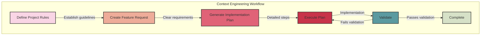

**Note:** This is a Mermaid diagram that can be rendered in GitHub or other Markdown viewers that support Mermaid syntax. If your viewer doesn't support Mermaid, you'll need to use a Mermaid renderer or convert this to an image.
